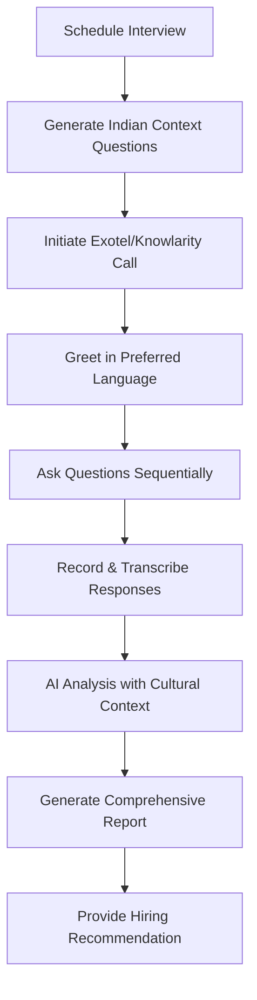

# 🇮🇳 AI Calling Interviewer - Indian Edition

An intelligent phone-based interview system built with **FastAPI** and optimized for the **Indian job market**, supporting **Exotel** and **Knowlarity** telephony services.

## 🌟 Features

### 🚀 Core Capabilities
- **FastAPI Framework**: High-performance async API
- **Indian Telephony Services**: Exotel & Knowlarity integration
- **Multi-language Support**: English, Hindi, Hinglish
- **AI-Powered Questions**: GPT-4 with Indian context
- **Cultural Intelligence**: Indian workplace and market insights
- **Comprehensive Reports**: Detailed analysis with salary recommendations

### 🇮🇳 Indian Market Optimizations
- **Local Phone Format**: +91 mobile number validation
- **Cultural Context**: Questions tailored for Indian workplace
- **Regional Languages**: Hindi and Hinglish support
- **Salary Insights**: INR-based compensation recommendations
- **Work Culture**: Remote work, time zones, client interaction focus

## 🛠️ Technology Stack

- **Backend**: FastAPI + Python 3.8+
- **AI**: OpenAI GPT-4
- **Telephony**: Exotel (Primary), Knowlarity (Alternative)
- **Database**: In-memory (can be extended to PostgreSQL/MongoDB)
- **Validation**: Pydantic models
- **Documentation**: Auto-generated OpenAPI/Swagger

## 🚀 Quick Start

### Prerequisites

1. **Exotel Account**: Sign up at [exotel.com](https://exotel.com)
2. **Knowlarity Account**: Sign up at [knowlarity.com](https://knowlarity.com) (optional)
3. **OpenAI API Key**: Get from [platform.openai.com](https://platform.openai.com)
4. **ngrok**: For webhook handling

### Installation

```bash
# Clone repository
git clone <repository-url>
cd AI-Calling-Agent

# Create virtual environment
python -m venv venv
source venv/bin/activate  # On Windows: venv\Scripts\activate

# Install dependencies
pip install -r requirements.txt

# Setup environment variables
cp .env.example .env
# Edit .env with your API keys
```

### Configuration

Edit `.env` file:

```env
# OpenAI
OPENAI_API_KEY=sk-...

# Exotel (Primary)
EXOTEL_SID=your_sid
EXOTEL_TOKEN=your_token
EXOTEL_SUBDOMAIN=your_subdomain
EXOTEL_FROM_NUMBER=your_number

# Knowlarity (Alternative)
KNOWLARITY_API_KEY=your_api_key
KNOWLARITY_SUPER_NUMBER=your_super_number

# Webhooks
WEBHOOK_BASE_URL=https://your-domain.ngrok.io
```

### Run Application

```bash
# Start the server
python main.py

# Or using uvicorn directly
uvicorn main:app --host 0.0.0.0 --port 8000 --reload
```

### Setup ngrok for Webhooks

```bash
# In a new terminal
ngrok http 8000

# Update WEBHOOK_BASE_URL in .env with ngrok URL
```

## 📡 API Endpoints

### 📋 Schedule Interview
```http
POST /api/v1/schedule-interview
Content-Type: application/json

{
    "candidate_name": "Rahul Sharma",
    "position": "Software Engineer", 
    "phone_number": "+919876543210",
    "experience_level": "mid",
    "preferred_language": "hinglish",
    "interview_duration": 25
}
```

### 📞 Start Interview
```http
POST /api/v1/start-interview/{session_id}?service=exotel
```

### 📊 Get Status
```http
GET /api/v1/interview/{session_id}/status
```

### 📄 Generate Report
```http
GET /api/v1/interview/{session_id}/report
```

### 📋 Active Sessions
```http
GET /api/v1/active-sessions
```

## 🧪 Testing

Run the comprehensive test suite:

```bash
python test_api.py
```

Test individual endpoints:

```bash
# Health check
curl http://localhost:8000/health

# Schedule interview
curl -X POST http://localhost:8000/api/v1/schedule-interview \
  -H "Content-Type: application/json" \
  -d '{"candidate_name":"Test User","position":"Developer","phone_number":"+919876543210","experience_level":"mid","preferred_language":"english"}'
```

## 📊 Sample Interview Flow



## 🇮🇳 Indian Context Features

### Question Generation
- **Technical**: Indian tech stack preferences (Java, Python, React)
- **Behavioral**: Cultural diversity, client interaction, remote work
- **Career**: Growth expectations, family considerations, location flexibility
- **Market**: Startup vs MNC preferences, salary expectations

### Cultural Intelligence
- **Communication Style**: Direct vs indirect communication analysis
- **Work-Life Balance**: Family priorities and flexibility needs
- **Career Growth**: Indian career progression patterns
- **Team Dynamics**: Multi-cultural team collaboration

### Language Support
- **English**: Standard professional interviews
- **Hindi**: Complete Hindi language support
- **Hinglish**: Mixed Hindi-English for comfort

## 🔧 Customization

### Add New Telephony Service

```python
class NewTelephonyService:
    async def make_call(self, to_number: str, callback_url: str) -> Dict:
        # Implement your service API call
        pass
```

### Customize Questions

```python
# Modify in generate_interview_questions method
self.indian_context_prompts = {
    "technical": "Your custom technical context",
    "behavioral": "Your custom behavioral context"
}
```

### Add New Languages

```python
# In InterviewQuestion model
gujarati_translation: Optional[str] = None
tamil_translation: Optional[str] = None
```

## 🏗️ Architecture

```
┌─────────────────┐    ┌─────────────────┐    ┌─────────────────┐
│   FastAPI       │    │  AI Interviewer │    │ Exotel/Knowlarity│
│                 │    │                 │    │                 │
│ • REST APIs     │◄──►│ • Question Gen  │◄──►│ • Voice Calls   │
│ • Validation    │    │ • Analysis      │    │ • Webhooks      │
│ • Documentation │    │ • Reports       │    │ • Recording     │
└─────────────────┘    └─────────────────┘    └─────────────────┘
         │                       │                       │
         ▼                       ▼                       ▼
┌─────────────────┐    ┌─────────────────┐    ┌─────────────────┐
│   Pydantic      │    │   OpenAI GPT-4  │    │   Indian        │
│   Models        │    │   with Context   │    │   Candidates    │
└─────────────────┘    └─────────────────┘    └─────────────────┘
```

## 🔒 Security & Compliance

- **Data Privacy**: GDPR and Indian data protection compliance
- **API Security**: Input validation with Pydantic
- **Secure Storage**: Environment variable protection
- **Audio Privacy**: Secure recording handling
- **Rate Limiting**: Built-in FastAPI rate limiting

## 🌐 Deployment

### Docker Deployment

```dockerfile
FROM python:3.9-slim

WORKDIR /app
COPY requirements.txt .
RUN pip install -r requirements.txt

COPY . .
EXPOSE 8000

CMD ["uvicorn", "main:app", "--host", "0.0.0.0", "--port", "8000"]
```

### Production Considerations

- Use PostgreSQL/MongoDB for persistence
- Implement Redis for session caching
- Add comprehensive logging
- Set up monitoring and alerts
- Configure load balancing
- Implement audio transcription service

## 📈 Monitoring & Analytics

- **Interview Metrics**: Success rates, duration, completion
- **Performance**: API response times, error rates
- **Business Intelligence**: Hiring patterns, candidate insights
- **Quality Metrics**: Audio quality, transcription accuracy

## 🤝 Contributing

1. Fork the repository
2. Create feature branch (`git checkout -b feature/amazing-feature`)
3. Commit changes (`git commit -m 'Add amazing feature'`)
4. Push to branch (`git push origin feature/amazing-feature`)
5. Open Pull Request

## 📞 Support

- **Documentation**: [API Docs](http://localhost:8000/docs)
- **Issues**: GitHub Issues
- **Email**: support@your-domain.com
- **Phone**: +91-XXXXX-XXXXX

---

**🇮🇳 Proudly Built for the Indian Job Market**  
*Empowering Indian companies with AI-driven hiring solutions*