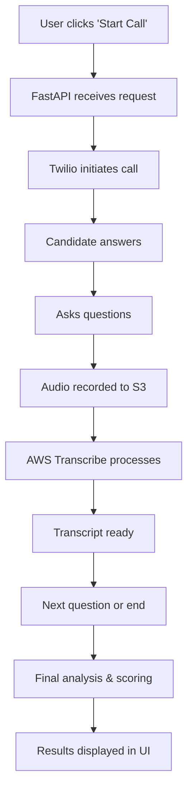

# 🇮🇳Calling Agent - Comprehensive Documentation
## 📋 Table of Contents
1. [Project Overview](#project-overview)
2. [🌟 Features](#-features)
3. [🛠️ Technology Stack](#️-technology-stack)
4. [🏗️ Architecture](#️-architecture)
5. [📁 Project Structure](#-project-structure)
6. [⚡ Quick Start](#-quick-start)
7. [🔧 Installation & Setup](#-installation--setup)
8. [📚 API Documentation](#-api-documentation)
9. [🎯 Frontend Components](#-frontend-components)
10. [🔄 Data Flow](#-data-flow)
11. [⚙️ Configuration](#️-configuration)
12. [🚀 Deployment](#-deployment)
13. [🐛 Troubleshooting](#-troubleshooting)
14. [🤝 Contributing](#-contributing)
## Project Overview
The **AI Calling Agent** is an intelligent interview automation platform that conducts phone interviews, transcribes responses in real-time, and provides comprehensive candidate analysis. Built specifically for the Indian market with cultural intelligence and local optimizations.
### 🎯 Key Capabilities
- 📞 **Automated Phone Interviews** - AI-powered structured interviews via Twilio
- 🎙️ **Real-time Transcription** - Live speech-to-text using AWS Transcribe
- 🔄 **Bulk Processing** - Handle multiple candidates simultaneously
## 🌟 Features
### 🚀 Core Capabilities
- **FastAPI Framework**: High-performance async API with auto-documentation
- **language Support**: English with Indian accent optimization
- **Cultural Intelligence**: Questions tailored for Indian workplace dynamics
- **Comprehensive Reports**: Detailed analysis with INR-based salary recommendations
### 📊 Advanced Analytics
- **Skills Detection**: Automatic identification of technical 
- **Experience Mapping**: Years of experience validation and assessment
- **JD Matching**: Job description compatibility scoring
## 🛠️ Technology Stack
### Frontend Stack
- **React 18** - Modern React with hooks and TypeScript
- **Material-UI (MUI)** - Professional component library
- **Vite** - Lightning-fast build tool
- **TypeScript** - Type-safe development
- **React Router** - Client-side routing
- **Axios** - API communication
- **React Toastify** - User notifications

### Backend Stack
- **FastAPI** - Modern Python web framework with async support
- **Python 3.12+** - Latest Python features
- **Pydantic** - Data validation and serialization
- **Uvicorn** - ASGI server for production
- **SQLite/JSON** - Lightweight data storage

### External Services
- **Twilio** - Voice calls and telephony
- **AWS Transcribe** - Speech-to-text conversion
- **AWS S3** - Audio file storage

## 🏗️ Architecture

```
┌─────────────────┐    ┌─────────────────┐    ┌─────────────────┐
│   React App     │    │   FastAPI       │    │    Twilio       │
│                 │    │                 │    │                 │
│ • Dashboard     │◄──►│ • REST APIs     │◄──►│ • Voice Calls   │
│ • Results View  │    │ • Validation    │    │ • Webhooks      │
│ • Bulk Ops      │    │ • Analysis      │    │ • Recording     │
└─────────────────┘    └─────────────────┘    └─────────────────┘
         │                       │                       │
         ▼                       ▼                       ▼
┌─────────────────┐    ┌─────────────────┐    ┌─────────────────┐
│   Material-UI   │    │   AWS Services  │    │   Backend.      │
│   Components    │    │ • Transcribe    │    │ • Analysis      │
│                 │    │ • S3 Storage    │    │ • Skills Match  │
└─────────────────┘    └─────────────────┘    └─────────────────┘
         │                       │                       │
         ▼                       ▼                       ▼
┌─────────────────┐    ┌─────────────────┐    ┌─────────────────┐
│   TypeScript    │    │   Interview     │    │   Indian        │
│   Type Safety   │    │   Engine        │    │   Candidates    │
└─────────────────┘    └─────────────────┘    └─────────────────┘
```

## 📁 Project Structure

```
AI-Calling-Agent/
├── 📁 Backend/                          # FastAPI Python backend
│   ├── 🐍 main.py                      # Main FastAPI application
│   ├── 📊 summary.py                   # AI analysis and reporting
│   ├── 📋 requirements.txt             # Python dependencies
│   ├── 🔐 .env                        # Environment variables
│   ├── 📁 config/                     # Configuration files
│   │   └── 📄 job_description.json    # Job requirements
│   ├── 📁 interviews/                 # Interview data storage
│   │   ├── 🎵 audio_recordings/       # Twilio call recordings
│   │   ├── 📝 transcriptions/         # AWS Transcribe outputs
│   │   └── 📄 *.json                  # Interview result files
│   ├── 📄 call_phone_mapping.json     # Phone number mappings
│   ├── 📄 contact_mappings.json       # Contact information
│   └── 📄 current_jd.json            # Active job description
│
└── 📁 interview-bot-frontend/          # React TypeScript frontend
    ├── 📁 src/                        # Source code
    │   ├── 📁 components/             # React components
    │   │   ├── 📞 CallDashboard.tsx   # Main calling interface
    │   │   ├── 📊 InterviewResults.tsx # Results & analytics
    │   │   ├── 📋 InterviewDetails.tsx # Individual interview view
    │   │   ├── 📜 CallHistory.tsx     # Historical call data
    │   │   └── 🔄 BulkCallDashboard.tsx # Bulk operations
    │   ├── 📁 api/                    # API layer
    │   │   └── 🔌 services.ts         # API service functions
    │   ├── 📱 App.tsx                 # Root application component
    │   ├── 🚀 main.tsx               # Application entry point
    │   └── 🎨 index.css              # Global styles
    ├── 📁 public/                     # Static assets
    ├── 📦 package.json               # Node.js dependencies
    ├── ⚡ vite.config.ts             # Vite build configuration
    └── 📝 tsconfig.json              # TypeScript configuration
```

## ⚡ Quick Start

### 🔥 1-Minute Setup
```bash
# Clone and setup backend
git clone <repository-url>
cd AI-Calling-Agent/Backend
python -m venv venv && source venv/bin/activate
pip install -r requirements.txt
uvicorn main:app --reload --port 8000

# Setup frontend (new terminal)
cd ../interview-bot-frontend
npm install && npm run dev
```

## 🔧 Installation & Setup

### 📋 Prerequisites
```bash
✅ Python 3.12+
✅ Node.js 18+
✅ Twilio Account
✅ AWS Account (for Transcribe & S3)
```

### 🐍 Backend Setup

1. **Environment Setup**
```bash
cd Backend
python -m venv venv

# Activate virtual environment
# Windows: venv\Scripts\activate
# macOS/Linux: source venv/bin/activate

pip install -r requirements.txt
```

2. **Environment Configuration**
```bash
# Create .env file with your credentials
cat > .env << EOF
# Twilio Configuration
TWILIO_ACCOUNT_SID=your_twilio_account_sid
TWILIO_AUTH_TOKEN=your_twilio_auth_token  
TWILIO_PHONE_NUMBER=+1234567890

# OpenAI Configuration
OPENAI_API_KEY=your_openai_api_key

# AWS Configuration
AWS_ACCESS_KEY_ID=your_aws_access_key
AWS_SECRET_ACCESS_KEY=your_aws_secret_key
AWS_REGION=us-east-1
AWS_S3_BUCKET=your-interview-bucket

# Application Settings
ENVIRONMENT=development
DEBUG=true
EOF
```

3. **Start Backend Server**
```bash
uvicorn main:app --reload --host 0.0.0.0 --port 8000
```
🎯 Backend running at `http://localhost:8000`

### ⚛️ Frontend Setup

1. **Install Dependencies**
```bash
cd interview-bot-frontend
npm install
```

2. **Environment Configuration**
```bash
# Create frontend environment file
echo "VITE_API_BASE_URL=http://localhost:8000" > .env
```

3. **Start Development Server**
```bash
npm run dev
```
🎯 Frontend running at `http://localhost:3000`

## 📚 API Documentation

### 🔌 Core Endpoints

#### Phone Call Management
```typescript
// 📞 Initiate Interview Call
POST /make-call
{
  "phone_number": "+919876543210",
}

// 📊 Get Call Status
GET /call-status/{call_sid}

// ⏹️ End Active Call
POST /end-call/{call_sid}

// 🔄 Handle Twilio Webhooks
POST /webhook
```
#### Interview Data & Analysis
```typescript
GET /get-all-interviews-detailed
Response: {
  "interviews": [InterviewData[]],
  "total_count": number,
  "completed_count": number
}
GET /interview/{interview_id}
POST /run-jd-analysis
Body: { "interview_ids": ["id1", "id2"] }
GET /jd-report/{interview_id}
```
#### Bulk Operations
```typescript
POST /upload-contacts
Content-Type: multipart/form-data
Body: FormData with CSV file
POST /start-bulk-calling
{
  "contact_ids": ["id1", "id2", "id3"],
  "delay_between_calls": 30,
  "max_concurrent_calls": 3
}
GET /bulk-call-status/{bulk_id}
```
### 📊 Data Models
#### Interview Response Structure
```typescript
interface InterviewData {
  call_sid: string;
  phone_number: string;
  candidate_name: string;
  status: 'IN_PROGRESS' | 'COMPLETED' | 'FAILED' | 'NO_ANSWER';
  start_time: string;
  end_time?: string;
  duration_minutes: number;
  responses: Array<{
    question: string;
    answer: string;
    confidence: number;  
    timestamp: string;
    question_number: number;
    audio_url?: string;
  }>;
  validation_results: {
    [step: string]: {
      step: number;
      passed: boolean;
      reason: string;
      confidence: number;
      skills_match?: boolean;
      found_skills?: string[];
      match_percentage?: number;
      experience_years?: number;
      experience_level?: 'junior' | 'mid' | 'senior';
      relocation_willing?: boolean;
      onsite_available?: boolean;
      notice_period_days?: number;
      current_ctc_inr?: number;
      expected_ctc_inr?: number;
      negotiable?: boolean;
    };
  };
  silence_prompts: number;
  last_activity: string;
  is_bulk_call: boolean;
  bulk_call_id?: string;
}
```
## 🎯 Frontend Components
### 📞 CallDashboard Component
**Purpose**: Main interface for initiating individual interviews
**Features**:
- 🔢 Phone number input with +91 validation
- ⏱️ Real-time call status monitoring  
- 📝 Live transcription display
- 🎛️ Call controls (start/end/pause)
**Usage**:
```tsx
import { CallDashboard } from './components/CallDashboard';

function App() {
  return <CallDashboard />;
}
```
### 📊 InterviewResults Component  
**Purpose**: Comprehensive candidate analysis and ranking
**Features**:
- 🏆 Sortable candidate leaderboard
- 📈 Skills analysis with visual charts
- 🔍 Expandable detailed interview views
- 📄 JSON report downloads
- 🎯 JD matching scores

**Key Functions**:
```tsx
const extractSkillsFromText = (text: string): string[] => {
  const skillKeywords = [
    'python', 'java', 'javascript', 'react', 'node.js',
    'aws'
  ];
  return skillKeywords.filter(skill => 
    text.toLowerCase().includes(skill)
  );
};
const calculateOverallScore = (interview: InterviewData) => {
  const skillsScore = interview.skills_percentage;
  const experienceScore = interview.experience_match;
  const responseQuality = interview.avg_confidence * 100;
  
  return Math.round(
    skillsScore * 0.4 + 
    experienceScore * 0.3 + 
    responseQuality * 0.3
  );
};
```

### 🔄 BulkCallDashboard Component
**Purpose**: Batch processing interface for multiple candidates

**Features**:
- 📁 CSV upload with validation
- 🚀 Batch call initiation with delays
- 📊 Real-time progress monitoring
- ⏸️ Individual call pause/resume

### 📋 InterviewDetails Component  
**Purpose**: Deep-dive analysis of individual interviews
**Features**:
- 🗣️ Question-by-question breakdown
- 📊 Confidence scoring visualization
- 🎯 Skills gap analysis
- 💰 Salary recommendation (INR)
- 📝 Detailed feedback notes
## 🔄 Data Flow
### 📞 Interview Process Flow

```mermaid
graph TD
    A[User clicks 'Start Call'] --> B[FastAPI receives request]
    B --> C[Twilio initiates call]
    C --> D[Candidate answers]
    D --> E[Asks questions]
    E --> F[Audio recorded to S3]
    F --> G[AWS Transcribe processes]
    G --> H[Transcript ready]
    H --> I[Next question or end]
    I --> J[Final analysis & scoring]
    J --> K[Results displayed in UI]

```
## ⚙️ Configuration
### 📋 Job Description Setup
Edit `Backend/config/job_description.json`:
```json
{
  "job_title": "Senior Python Developer",
  "company": "AI Interview Platform",
  "experience_required": "3-5 years",
  
  "required_skills": [
    "python", "django", "fastapi", "postgresql", 
    "docker", "aws", "git", "rest apis"
  ],
}
```


### ☁️ AWS Deployment
**Backend on EC2**:
```bash
# Launch EC2 instance (t3.medium recommended)
# Install dependencies
sudo yum update -y
sudo yum install python3 python3-pip -y

# Deploy application
cd AI-Calling-Agent/Backend
pip3 install -r requirements.txt

```

TWILIO_ACCOUNT_SID=prod_account_sid
TWILIO_AUTH_TOKEN=prod_auth_token
```

## 🐛 Troubleshooting

### 🔥 Common Issues & Solutions

#### 1. 📞 Twilio Call Failures
```bash
# Check webhook URL accessibility
curl -X POST https://your-domain.com/webhook -H "Content-Type: application/x-www-form-urlencoded"

# Verify Twilio credentials
python -c "
from twilio.rest import Client
client = Client('your_sid', 'your_token')
print(client.api.accounts.list())
"

# Test phone number format
# ✅ Correct: +91.........
app.add_middleware(
    CORSMiddleware,
    allow_origins=["http://localhost:3000", "https://your-domain.com"],
    allow_credentials=True,
    allow_methods=["*"],
    allow_headers=["*"],
)
```


## 📄 License

This project is developed for AI Interview Automation. All rights reserved.

## 📞 Support & Contact

- **🏢 Project**: AI Calling Agent
- **📧 Support**: Configure your support contact details
